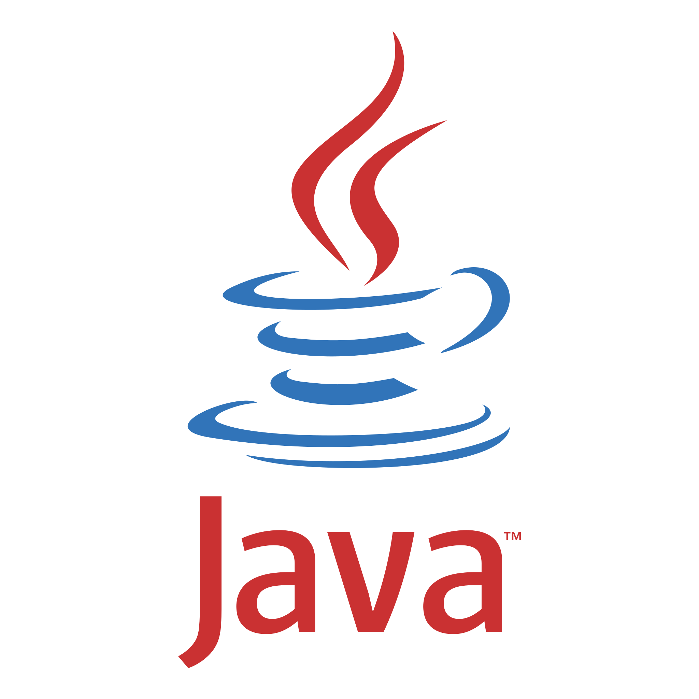

<!-- Improved compatibility of back to top link: See: https://github.com/othneildrew/Best-README-Template/pull/73 -->
<a id="readme-top"></a>

<!-- PROJECT LOGO -->
<div align="center">
  <a href="https://github.com/jerichd4c/Proyecto_DBcomponent">
    
  </a>

  <h3 align="center">ReflexJDBC</h3>

  <p align="center">
    A lightweight Java tool for simplified database connection pooling and SQL query management.
  </p>
</div>

<!-- TABLE OF CONTENTS -->
<details>
  <summary>Table of Contents</summary>
  <ol>
    <li>
      <a href="#about-the-project">About The Project</a>
      <ul>
        <li><a href="#built-with">Built With</a></li>
      </ul>
    </li>
    <li>
      <a href="#getting-started">Getting Started</a>
      <ul>
        <li><a href="#prerequisites">Prerequisites</a></li>
        <li><a href="#installation">Installation</a></li>
      </ul>
    </li>
    <li><a href="#usage">Usage</a></li>
    <li><a href="#roadmap">Roadmap</a></li>
    <li><a href="#license">License</a></li>
  </ol>
</details>

<!-- ABOUT THE PROJECT -->
## About The Project

ReflexJDBC is a Java-based database abstraction layer designed to simplify database interactions. It provides a clean interface for:
* **Connection Pooling**: Efficiently manage database connections.
* **Query Management**: Externalize SQL queries in property files for better maintainability.
* **Transaction Management**: Support for atomic operations and rollbacks.
* **Multi-DB Support**: Easily configure and switch between multiple database instances.

<p align="right">(<a href="#readme-top">back to top</a>)</p>

### Built With

* [![Java][Java-shield]][Java-url]
* [![PostgreSQL][PostgreSQL-shield]][PostgreSQL-url]

<p align="right">(<a href="#readme-top">back to top</a>)</p>

<!-- GETTING STARTED -->
## Getting Started

To get a local copy up and running, follow these steps.

### Prerequisites

* Java JDK 11 or higher
* PostgreSQL Database

### Installation

1. Clone the repo
   ```sh
   git clone https://github.com/jerichd4c/Proyecto_DBcomponent.git
   ```
2. Download the [PostgreSQL JDBC Driver](https://jdbc.postgresql.org/download/).
3. Place the `.jar` file in your project root and add it to your project's classpath in your IDE (e.g., *Referenced Libraries* in VS Code or *Project Structure* in IntelliJ).
4. Configure your database settings in `src/main/resources/*.properties`.

<p align="right">(<a href="#readme-top">back to top</a>)</p>

<!-- USAGE EXAMPLES -->
## Usage

You can find a complete demonstration of the component's capabilities in `src/main/java/reflexjdbc/demo/appDemo.java`.

Key operations include:
```java
import reflexjdbc.core.*;

// Loading configuration
DBconfig config = DBconfigLoader.cargarConfig("/primarydbconfig.properties", DBtype.GENERICA);

// Initializing the component
componenteGenerico db = new componenteGenerico(config);
db.inicializar();
// Executing updates
db.ejecutarUpdate("INSERT INTO users (name) VALUES (?)", "John Doe");

// Executing queries
ResultSet rs = db.ejecutarQuery("SELECT * FROM users");
```

<p align="right">(<a href="#readme-top">back to top</a>)</p>

<!-- ROADMAP -->
## Roadmap

- [ ] Translate source code and comments to English
- [ ] Add support for additional database types (MySQL, SQLite)
- [ ] Implement a more robust logging system

See the [open issues](https://github.com/jerichd4c/Proyecto_DBcomponent/issues) for a full list of proposed features (and known issues).

<p align="right">(<a href="#readme-top">back to top</a>)</p>

<!-- LICENSE -->
## License

Distributed under the MIT License.

<p align="right">(<a href="#readme-top">back to top</a>)</p>

<!-- MARKDOWN LINKS & IMAGES -->
[contributors-shield]: https://img.shields.io/github/contributors/jerichd4c/Proyecto_DBcomponent.svg?style=for-the-badge
[contributors-url]: https://github.com/jerichd4c/Proyecto_DBcomponent/graphs/contributors
[forks-shield]: https://img.shields.io/github/forks/jerichd4c/Proyecto_DBcomponent.svg?style=for-the-badge
[forks-url]: https://github.com/jerichd4c/Proyecto_DBcomponent/network/members
[stars-shield]: https://img.shields.io/github/stars/jerichd4c/Proyecto_DBcomponent.svg?style=for-the-badge
[stars-url]: https://github.com/jerichd4c/Proyecto_DBcomponent/stargazers
[issues-shield]: https://img.shields.io/github/issues/jerichd4c/Proyecto_DBcomponent.svg?style=for-the-badge
[issues-url]: https://github.com/jerichd4c/Proyecto_DBcomponent/issues
[license-shield]: https://img.shields.io/github/license/jerichd4c/Proyecto_DBcomponent.svg?style=for-the-badge
[license-url]: https://github.com/jerichd4c/Proyecto_DBcomponent/blob/master/LICENSE
[linkedin-shield]: https://img.shields.io/badge/-LinkedIn-black.svg?style=for-the-badge&logo=linkedin&colorB=555
[linkedin-url]: https://linkedin.com/in/sebastian-lorenzo-uru
[Java-shield]: https://img.shields.io/badge/java-%23ED8B00.svg?style=for-the-badge&logo=openjdk&logoColor=white
[Java-url]: https://www.java.com/
[PostgreSQL-shield]: https://img.shields.io/badge/PostgreSQL-316192?style=for-the-badge&logo=postgresql&logoColor=white
[PostgreSQL-url]: https://www.postgresql.org/

<!-- ACKNOWLEDGMENTS -->
## Acknowledgments
* [PostgreSQL JDBC Driver](https://jdbc.postgresql.org/download/)

<p align="right">(<a href="#readme-top">back to top</a>)</p>